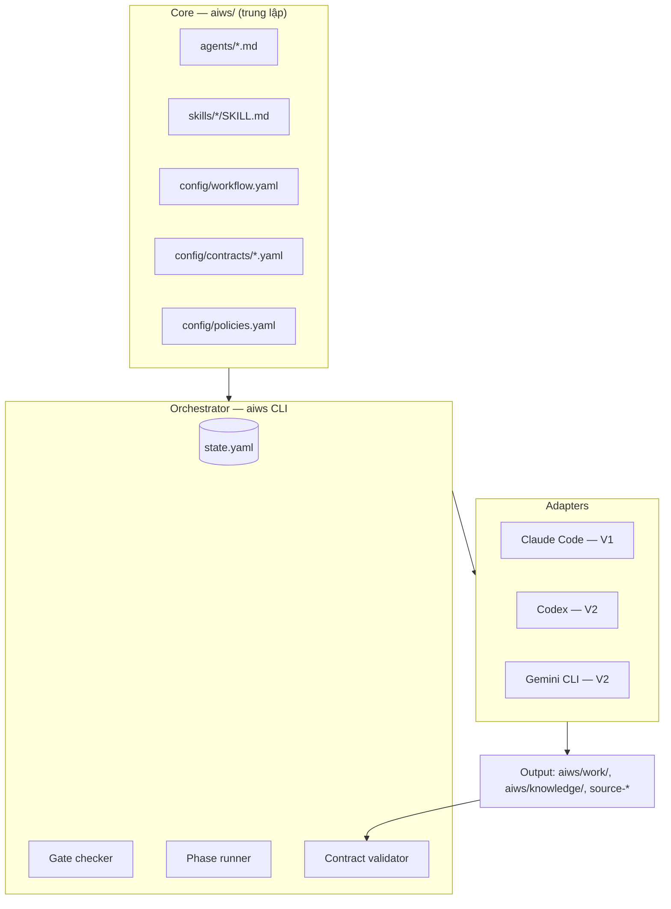
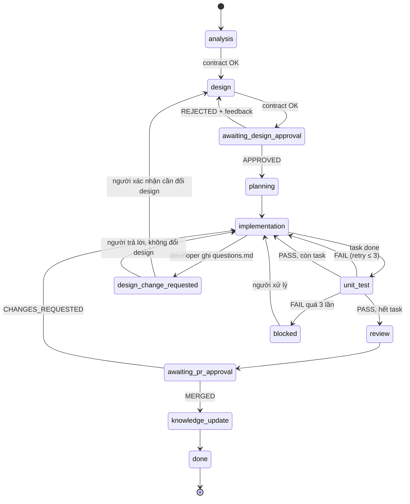

# AI Software Factory — Spec V1 (Claude Code first)

Sep 26, 2026 · @van.nguyenthanh

## 1. Tổng quan & mục tiêu

AIWS biến một requirement thành code đã test, qua các phase có kiểm soát và có human gate. V1 chạy trên Claude Code; Codex và Gemini được hỗ trợ sau qua lớp adapter, không phải viết lại.

**Phạm vi MVP (V1):** Discovery → Requirement Analysis → Design + Test Spec → Human Approve → Implementation theo task → Unit Test → Human Review PR. Security, E2E, UAT, Deploy để V2.

**Nguyên tắc thiết kế:**

1. **Core trung lập với AI.** Mọi định nghĩa agent, skill, workflow, contract nằm trong `aiws/` dạng Markdown/YAML, không phụ thuộc cú pháp riêng của tool nào.
2. **Orchestrator deterministic.** Một CLI nhỏ (`aiws`) giữ state và quyết định phase nào được chạy. LLM không tự chuyển state.
3. **Enforce bằng cơ chế thật.** Gate được chặn bằng hook, permission và git, không chỉ bằng lời dặn trong prompt.
4. **Mọi thứ là file trong repo.** State, output từng phase, approval, evidence đều commit vào git để review và truy vết.
5. **Task nhỏ.** Mỗi lần coding chỉ làm một task có phạm vi file và test rõ ràng.
6. **Test sinh từ requirement, trước khi code.** Human duyệt test spec cùng với design.

**Ngoài phạm vi V1:** tự động deploy production, multi-repo orchestration, UI dashboard, chạy nhiều REQ song song ở các phase ghi source (V1 chạy tuần tự, xem mục 4).

## 2. Kiến trúc tổng thể

Hệ thống có 3 lớp: **Core** định nghĩa *làm gì*, **Orchestrator** quyết định *khi nào được làm*, **Adapter** quyết định *làm bằng AI nào*.



**Luồng một phase:** `aiws run <phase>` → gate checker đọc `state.yaml` + `policies.yaml` → phase runner build prompt từ agent + skill + contract → adapter gọi AI ở chế độ headless với quyền giới hạn → contract validator kiểm tra output → cập nhật state → ghi evidence.

**Vì sao tách adapter:** mỗi tool có cách khai báo agent, skill, hook, permission khác nhau. Adapter "biên dịch" định nghĩa trong `aiws/` sang định dạng của tool (`aiws sync claude` sinh ra `.claude/`, `CLAUDE.md`). Core không đổi khi thêm AI mới.

## 3. Cấu trúc thư mục

Một repo "workspace" chứa toàn bộ dự án. `source-*` có thể là git submodule nếu FE/BE nằm ở repo riêng.

```
project/
├── AGENTS.md                  # hướng dẫn chung, mọi AI đều đọc (phải ở gốc)
├── CLAUDE.md                  # chỉ 1 dòng: @AGENTS.md (sinh bởi adapter)
├── .claude/                   # SINH TỰ ĐỘNG bởi `aiws sync claude` (phải ở gốc)
│   ├── agents/
│   ├── skills/
│   └── settings.json          # permissions + hooks
│
├── requirements/              # INPUT của người
│   └── REQ-001-user-management.md
│
├── source-fe/                 # code FE (target)
├── source-be/                 # code BE (target)
├── source-legacy/             # hệ thống cũ — READ-ONLY vĩnh viễn
│
└── aiws/                      # TOÀN BỘ HỆ THỐNG AIWS
    │
    ├── config/                # NGƯỜI sở hữu
    │   ├── workflow.yaml      # định nghĩa phase, thứ tự, gate
    │   ├── policies.yaml      # quyền ghi theo phase, gate bắt buộc
    │   ├── runtime.yaml       # chọn adapter/AI theo phase
    │   └── contracts/         # schema input/output từng phase
    │       └── <phase>.yaml
    ├── agents/                # NGƯỜI — vai trò (Markdown + frontmatter)
    │   ├── discovery.md
    │   ├── analyst.md
    │   ├── architect.md
    │   ├── test-designer.md
    │   ├── planner.md
    │   ├── developer.md
    │   ├── tester.md
    │   └── reviewer.md
    ├── skills/                # NGƯỜI — kiến thức/quy trình tái sử dụng
    │   ├── legacy-analysis/SKILL.md
    │   ├── requirement-analysis/SKILL.md
    │   ├── api-design/SKILL.md
    │   ├── db-design/SKILL.md
    │   ├── fe-conventions/SKILL.md
    │   ├── be-conventions/SKILL.md
    │   └── unit-testing/SKILL.md
    ├── templates/             # NGƯỜI — mẫu file output
    │
    ├── knowledge/             # AI ghi (discover), cập nhật dần
    │   ├── system-map.md
    │   ├── api-inventory.md
    │   ├── db-schema.md
    │   ├── glossary.md
    │   └── conventions.md
    │
    ├── work/                  # AI ghi theo từng requirement
    │   ├── .source-lock       # chỉ orchestrator ghi; V1 chạy tuần tự
    │   └── REQ-001/
    │       ├── state.yaml     # chỉ orchestrator ghi
    │       ├── 01-analysis.md
    │       ├── 02-design.md
    │       ├── 03-test-spec.md
    │       ├── api-contract.yaml  # OpenAPI, cầu nối FE–BE
    │       ├── 04-plan.yaml
    │       ├── approvals/     # chỉ người ghi
    │       │   ├── design-01.yaml
    │       │   └── design-02.yaml   # mỗi vòng duyệt 1 file
    │       └── evidence/
    │           ├── runs/
    │           └── test-results/
    │
    └── adapters/              # ORCHESTRATOR + ADAPTER (code)
        ├── cli/               # aiws CLI
        ├── claude/
        ├── codex/
        └── gemini/
```

**Quy ước quan trọng:** mọi thứ của AIWS nằm trong `aiws/`, thả vào dự án nào cũng được. Chỉ `AGENTS.md`, `CLAUDE.md` và `.claude/` ở gốc, vì Claude Code, Codex, Gemini tìm các file này tại thư mục làm việc. Bên trong `aiws/`: `config/`, `agents/`, `skills/`, `templates/` do người sở hữu; `knowledge/` và `work/` do AI sinh, người review; `adapters/` là code. `.claude/` là build output, không sửa tay.

## 4. State machine

Mỗi requirement có một `aiws/work/REQ-xxx/state.yaml`. Chỉ orchestrator được ghi file này; AI bị chặn ghi bằng hook.



**Đổi design giữa chừng:** khi quay lại `design` từ `design_change_requested`, design mới phải được approve lại (hash mới). Planner so plan cũ với design mới: task đã xong và không bị ảnh hưởng giữ nguyên `done`; task bị ảnh hưởng chuyển về `pending` hoặc sinh task sửa.

**Cập nhật knowledge:** sau khi PR merge, agent discovery chạy ở chế độ incremental trên diff của REQ và cập nhật `aiws/knowledge/`. Thay đổi knowledge đi qua một PR nhỏ để người review. Không có bước này, các REQ sau sẽ được phân tích trên bản đồ hệ thống đã cũ.

Discovery không nằm trong vòng đời REQ: chạy một lần cho repo (`aiws discover`) và chạy lại khi có thay đổi lớn. Phase `analysis` bị chặn nếu `aiws/knowledge/` chưa tồn tại.

**Ví dụ `state.yaml`:**

```yaml
req_id: REQ-001
title: User management
phase: implementation
status: running            # running | waiting_human | blocked | done
history:
  - {phase: analysis, result: ok, at: 2026-09-26T09:10:00Z, run: run-0001}
  - {phase: design,   result: ok, at: 2026-09-26T09:40:00Z, run: run-0002}
  - {phase: design_approval, result: approved, by: tuan, at: 2026-09-26T14:00:00Z,
     artifact_hash: sha256:9f2c…}
tasks:
  - {id: T1, status: done,    commit: a1b2c3d}
  - {id: T2, status: running, attempts: 1}
  - {id: T3, status: pending}
branch: aiws/REQ-001
```

**Quy tắc bất biến:**

- `artifact_hash` ghi lại hash của `02-design.md` + `03-test-spec.md` lúc approve. Nếu file bị sửa sau đó, orchestrator coi approval mất hiệu lực và quay về `awaiting_design_approval`.
- Không có lệnh "skip phase". Muốn bỏ qua phải sửa `workflow.yaml`, tức là thay đổi có review.
- Retry có giới hạn; vượt giới hạn → `blocked`, không để AI loay hoay vô hạn.
- Approval không bao giờ bị ghi đè: mỗi vòng là một file đánh số (`design-01.yaml`, `design-02.yaml`…). Feedback của mọi vòng reject trước được đưa vào prompt của lần design sau.
- **V1 chạy tuần tự:** tại một thời điểm chỉ một REQ được ở các phase ghi source (`implementation` → `knowledge_update`). Các REQ khác vẫn có thể chạy `analysis`/`design` song song vì chỉ ghi vào thư mục `work/` của riêng mình. Orchestrator giữ lock file `aiws/work/.source-lock`.

## 5. Contract Input/Output từng phase

Mỗi phase có contract: đọc gì, được ghi gì, output phải có những gì. Validator kiểm tra output trước khi cho chuyển phase.

| Phase | Input (đọc) | Được ghi | Output bắt buộc | Kiểm tra tự động |
| --- | --- | --- | --- | --- |
| discover | source-fe, source-be, source-legacy | aiws/knowledge/ | system-map, api-inventory, db-schema, glossary, conventions | Đủ 5 file, mỗi file có các heading bắt buộc |
| analysis | REQ, aiws/knowledge/ | aiws/work/REQ/01-analysis.md | Mục tiêu, acceptance criteria đánh số, impact (module/API/bảng bị ảnh hưởng), reuse, câu hỏi mở | AC đánh số AC-1..n; không còn câu hỏi mở mức "blocking" |
| design | 01-analysis, aiws/knowledge/, source (đọc) | 02-design.md, 03-test-spec.md, api-contract.yaml | Quyết định chính + lý do, API, DB change, FE change, migration, rủi ro; test case map tới AC; API contract (OpenAPI) cho mọi endpoint mới/đổi | Mọi AC có ít nhất 1 test case; có mục "Quyết định cần duyệt"; api-contract.yaml hợp lệ |
| design\_approval | 02, 03, api-contract | approvals/design-NN.yaml (chỉ người) | approved/rejected, người duyệt, feedback | Hash khớp |
| planning | 02, 03 | 04-plan.yaml | Task list: id, mô tả, file được phép sửa, test liên quan, phụ thuộc | Mỗi task ≤ \~10 file; mọi test case thuộc 1 task |
| implementation | 1 task trong plan, 02, 03, api-contract | Chỉ các file khai báo trong task | Code + test của task, commit có trailer | Diff chỉ chạm file cho phép; build pass; lint pass |
| unit\_test | code của task | aiws/work/REQ/evidence/test-results/ | Kết quả test | Test của task pass; không test cũ nào fail |
| review | diff toàn nhánh, 02, 03, api-contract | aiws/work/REQ/05-review.md | Findings theo mức độ, đối chiếu design | Không còn finding "critical" mở; BE và FE khớp api-contract |
| pr\_approval | PR | — (người, trên git host) | Merge hoặc yêu cầu sửa | PR merged |
| knowledge\_update | diff đã merge, aiws/knowledge/ | aiws/knowledge/ | Knowledge cập nhật theo thay đổi của REQ | PR knowledge được merge |

**API contract là cầu nối FE–BE.** Unit test hai phía có thể cùng pass mà FE vẫn gọi sai API của BE. `api-contract.yaml` do architect sinh và người duyệt cùng design. Ở phase review, orchestrator chạy check tự động: BE expose đúng contract (vd. so với OpenAPI sinh từ code BE), FE gọi đúng path/schema trong contract (vd. sinh type client từ contract rồi build FE). Công cụ cụ thể chọn theo stack của dự án.

**Ví dụ `aiws/config/contracts/implementation.yaml`:**

```yaml
phase: implementation
agent: developer
skills: [fe-conventions, be-conventions, unit-testing]
reads:
  - aiws/work/{req}/02-design.md
  - aiws/work/{req}/03-test-spec.md
  - aiws/work/{req}/04-plan.yaml#tasks[{task}]
  - aiws/knowledge/conventions.md
writes: "{task.allowed_files}"   # lấy từ plan
checks:
  - cmd: "aiws check diff-scope --task {task}"
  - cmd: "npm run build --prefix source-fe"
    when: "task.touches_fe"
  - cmd: "./mvnw -q compile -f source-be"
    when: "task.touches_be"
  - cmd: "aiws check commit-trailer --req {req} --task {task}"
max_attempts: 3
```

Lệnh build/test ở trên chỉ là ví dụ; mỗi dự án khai báo lệnh thật trong `aiws/config/policies.yaml`.

## 6. Agent roles & skills

**Agent** là một vai trò với quyền hạn cụ thể. **Skill** là kiến thức hoặc quy trình mà nhiều agent dùng chung. Tách như vậy để đổi convention FE chỉ cần sửa một skill, không sửa từng agent.

| Agent | Phase | Quyền | Skills dùng |
| --- | --- | --- | --- |
| discovery | discover | Đọc toàn bộ source; ghi knowledge/ | legacy-analysis |
| analyst | analysis | Đọc REQ + knowledge; ghi 01-analysis | requirement-analysis |
| architect | design | Đọc source + knowledge; ghi 02-design | api-design, db-design, fe/be-conventions |
| test-designer | design | Đọc 01, 02; ghi 03-test-spec | unit-testing |
| planner | planning | Đọc 02, 03; ghi 04-plan | — |
| developer | implementation | Ghi đúng file của task; chạy build/test | fe/be-conventions, unit-testing |
| tester | unit\_test | Chạy test; ghi evidence; không sửa code | unit-testing |
| reviewer | review | Chỉ đọc diff; ghi 05-review | fe/be-conventions, api-design |

**Định dạng agent trung lập** (`aiws/agents/developer.md`):

```markdown
---
id: developer
description: Hiện thực đúng MỘT task trong plan đã được duyệt.
phase: implementation
tools: [read, edit, write, bash]
skills: [fe-conventions, be-conventions, unit-testing]
model_hint: strong-coding      # adapter tự map sang model cụ thể
---

# Vai trò
Bạn là developer. Bạn chỉ hiện thực task {task} của {req}.

# Quy tắc
- Chỉ sửa các file liệt kê trong allowed_files của task.
- Không đổi thiết kế. Nếu design sai hoặc thiếu, DỪNG và ghi
  vào work/{req}/questions.md, không tự quyết.
- Viết test theo đúng test case được gán trong 03-test-spec.md.
- Chạy build + test của task trước khi báo xong.
- Commit với trailer: `REQ-ID: {req}` và `Task: {task}`.

# Output
Báo cáo cuối: file đã sửa, test đã thêm, kết quả chạy test.
```

**Định dạng skill:** dùng chuẩn thư mục `SKILL.md` (frontmatter `name` + `description`, thân là hướng dẫn, có thể kèm file tham chiếu và script). Claude Code hỗ trợ trực tiếp định dạng này, nên V1 gần như chỉ cần copy. Cần kiểm tra mức hỗ trợ của Codex/Gemini tại thời điểm làm V2.

Skill quan trọng nhất cần viết tay ban đầu là `fe-conventions` và `be-conventions`, trích từ code hiện có: cấu trúc thư mục, pattern gọi API, xử lý lỗi, đặt tên, cách viết test. Discovery có thể sinh bản nháp, nhưng người phải chốt.

## 7. Workflow YAML

`aiws/config/workflow.yaml` là nguồn sự thật duy nhất về thứ tự phase và gate. Orchestrator đọc file này; AI không đọc.

```yaml
version: 1
name: software-project-mvp

prerequisites:
  - aiws/knowledge/system-map.md # phải chạy `aiws discover` trước

concurrency:
  source_lock: true               # 1 REQ ở implementation→knowledge_update tại 1 thời điểm

phases:
  - id: analysis
    agent: analyst
    contract: contracts/analysis.yaml
    next: design

  - id: design
    steps:                        # chạy tuần tự trong 1 phase
      - agent: architect
        contract: contracts/design.yaml       # 02-design.md + api-contract.yaml
      - agent: test-designer
        contract: contracts/test-spec.yaml
    next: design_approval

  - id: design_approval
    type: human_gate
    artifacts: [02-design.md, 03-test-spec.md, api-contract.yaml]
    record: approvals/design-{NN}.yaml     # đánh số, không ghi đè
    on_approve: planning
    on_reject: design                      # feedback mọi vòng được đưa vào prompt

  - id: planning
    agent: planner
    contract: contracts/plan.yaml
    replan_on_design_change: true          # giữ task done không bị ảnh hưởng
    next: implementation

  - id: implementation
    type: loop
    requires_lock: source
    over: plan.tasks                       # lần lượt từng task, theo depends_on
    steps:
      - agent: developer
        contract: contracts/implementation.yaml
      - agent: tester
        contract: contracts/unit-test.yaml
    on_fail: {retry: 3, then: blocked}
    on_question: design_change_requested   # developer ghi questions.md
    next: review

  - id: design_change_requested
    type: human_gate
    artifacts: [questions.md]
    on_design_change: design               # phải approve lại
    on_answer: implementation              # người trả lời, design giữ nguyên

  - id: review
    agent: reviewer
    contract: contracts/review.yaml
    checks: [api-contract-be, api-contract-fe]
    on_critical: implementation            # tạo task sửa lỗi mới
    next: pr_approval

  - id: pr_approval
    type: human_gate
    via: git_host
    on_approve: knowledge_update
    on_changes_requested: implementation

  - id: knowledge_update
    agent: discovery
    mode: incremental                      # chỉ trên diff của REQ
    contract: contracts/knowledge-update.yaml
    release_lock: source
    next: done
```

**Lệnh CLI tối thiểu cho V1:**

| Lệnh | Tác dụng |
| --- | --- |
| `aiws init` | Tạo thư mục `aiws/` và các file mẫu |
| `aiws sync claude` | Sinh `.claude/` + `CLAUDE.md` từ `aiws/` |
| `aiws discover` | Chạy discovery, sinh `aiws/knowledge/` |
| `aiws new REQ-001` | Tạo `aiws/work/REQ-001/`, nhánh `aiws/REQ-001` |
| `aiws run REQ-001` | Chạy tới human gate kế tiếp rồi dừng |
| `aiws status [REQ]` | Hiển thị phase, task, lỗi |
| `aiws approve REQ-001 design` | Ghi approval + hash, mở khoá phase sau |
| `aiws reject REQ-001 design -m "..."` | Ghi feedback, quay lại design |
| `aiws resume REQ-001` | Tiếp tục sau khi người xử lý `blocked` |

## 8. Approval & enforcement

Gate được bảo vệ bởi 4 lớp độc lập. Nếu một lớp bị vượt qua, lớp sau vẫn chặn.

| Lớp | Cơ chế | Chặn cái gì |
| --- | --- | --- |
| 1. Orchestrator | Không gọi agent của phase bị khoá | Coding chạy khi design chưa duyệt |
| 2. Tool permission | Mỗi lần gọi headless chỉ cấp tool cần thiết (vd. reviewer không có edit/write) | Agent dùng tool ngoài vai trò |
| 3. Hook | PreToolUse hook đọc `state.yaml` + `policies.yaml`, chặn edit/write ngoài phạm vi | Ghi vào source khi chưa tới phase; ghi file ngoài task; ghi `state.yaml`, `approvals/`, `source-legacy/` |
| 4. Git | Nhánh `aiws/REQ-xxx`; `main` bị branch protection; CI chạy lại toàn bộ check | Code chưa review vào main |

**Đâu là đảm bảo thật:** lớp 1 (orchestrator) và `aiws check diff-scope` sau mỗi lần chạy là đảm bảo thật; hook chỉ giúp chặn sớm. Lý do: agent có Bash vẫn có thể ghi file mà không qua Edit/Write (vd. `echo > file`, hoặc một script trong `package.json`). Diff-scope so trạng thái git trước và sau lần chạy, bắt mọi thay đổi ngoài phạm vi bất kể bằng cách nào, rồi revert và đánh fail.

**Approval ghi như thế nào** (`aiws/work/REQ-001/approvals/design-01.yaml`):

```yaml
gate: design
decision: approved          # approved | rejected
by: tuan
at: 2026-09-26T14:00:00Z
artifacts:
  02-design.md: sha256:9f2c…
  03-test-spec.md: sha256:41ab…
notes: "Đồng ý dùng bảng user_roles thay vì cột role."
```

**Chống AI tự approve.** Chặn ghi file `approvals/` là chưa đủ, vì agent có Bash có thể tự chạy `aiws approve`. Vì vậy:

- `aiws approve`, `aiws reject`, `aiws resume` và mọi lệnh sửa state nằm trong `bash_denylist`, bị `aiws guard --bash` chặn.
- Bản thân lệnh `aiws approve` từ chối chạy nếu phát hiện đang ở trong phiên AI (có biến `AIWS_PHASE`, hoặc tiến trình cha là CLI của AI) và yêu cầu xác nhận tương tác (gõ lại mã REQ).
- Commit chứa file approval phải là signed commit của người có quyền duyệt; CI từ chối approval không có chữ ký hợp lệ.
- Mỗi vòng duyệt là một file mới (`design-01.yaml`, `design-02.yaml`…), không ghi đè.

**`aiws/config/policies.yaml`:**

```yaml
protected_paths:            # không agent nào được ghi, ở mọi phase
  - source-legacy/**
  - requirements/**
  - aiws/config/**
  - aiws/agents/**
  - aiws/skills/**
  - aiws/templates/**
  - aiws/adapters/**
  - aiws/work/*/state.yaml
  - aiws/work/*/approvals/**
  - aiws/work/.source-lock
  - AGENTS.md
  - CLAUDE.md
  - .claude/**

read_deny:                  # không agent nào được đọc
  - "**/.env*"
  - "**/secrets/**"
  - "**/*.pem"
  - "**/*.key"

phase_write_scope:
  discover:         [aiws/knowledge/**]
  analysis:         ["aiws/work/{req}/01-analysis.md", "aiws/work/{req}/questions.md"]
  design:           ["aiws/work/{req}/02-design.md", "aiws/work/{req}/03-test-spec.md",
                     "aiws/work/{req}/api-contract.yaml"]
  planning:         ["aiws/work/{req}/04-plan.yaml"]
  implementation:   ["{task.allowed_files}", "aiws/work/{req}/questions.md"]
  unit_test:        ["aiws/work/{req}/evidence/**"]
  review:           ["aiws/work/{req}/05-review.md"]
  knowledge_update: [aiws/knowledge/**]

commands:
  fe_build: "npm run build --prefix source-fe"
  fe_test:  "npm test --prefix source-fe -- {files}"
  be_build: "./mvnw -q compile -f source-be"
  be_test:  "./mvnw -q test -f source-be -Dtest={classes}"

bash_denylist:
  - "git push"
  - "git checkout main"
  - "rm -rf"
  - "curl"
  - "wget"
  - "aiws approve"
  - "aiws reject"
  - "aiws resume"
  - "aiws state"
  - "cat .env"
```

## 9. Adapter Claude Code (V1)

Claude Code có đủ 4 thứ cần: context file, subagent, skill và hook chặn tool. `aiws sync claude` sinh toàn bộ phần dưới từ `aiws/`. Cú pháp dưới đây theo tài liệu Claude Code hiện hành; cần đối chiếu lại docs khi hiện thực vì tool cập nhật thường xuyên.

**Mapping:**

| aiws (core) | Claude Code |
| --- | --- |
| `AGENTS.md` | `CLAUDE.md` chứa dòng `@AGENTS.md` (import) |
| `aiws/agents/*.md` | `.claude/agents/*.md` (subagent: frontmatter `name`, `description`, `tools`, `model`) |
| `aiws/skills/*/SKILL.md` | `.claude/skills/*/SKILL.md` (copy nguyên) |
| `policies.yaml` → protected\_paths | `permissions.deny` trong `.claude/settings.json` |
| `policies.yaml` → phase\_write\_scope | PreToolUse hook `aiws-guard` |
| `model_hint` | Map sang model cụ thể trong `aiws/adapters/claude/models.yaml` |

**`.claude/settings.json` (sinh tự động):**

```json
{
  "permissions": {
    "deny": [
      "Read(./**/.env*)", "Read(./**/secrets/**)", "Read(./**/*.pem)", "Read(./**/*.key)",
      "Edit(source-legacy/**)", "Write(source-legacy/**)",
      "Edit(requirements/**)",
      "Edit(aiws/config/**)", "Edit(aiws/agents/**)", "Edit(aiws/skills/**)",
      "Edit(aiws/templates/**)", "Edit(aiws/adapters/**)",
      "Edit(aiws/work/*/state.yaml)", "Write(aiws/work/*/approvals/**)",
      "Write(aiws/work/.source-lock)",
      "Edit(.claude/**)", "Edit(AGENTS.md)", "Edit(CLAUDE.md)",
      "Bash(git push:*)", "Bash(curl:*)", "Bash(wget:*)",
      "Bash(aiws approve:*)", "Bash(aiws reject:*)", "Bash(aiws resume:*)", "Bash(aiws state:*)"
    ]
  },
  "hooks": {
    "PreToolUse": [
      {
        "matcher": "Edit|Write|MultiEdit|NotebookEdit",
        "hooks": [{ "type": "command", "command": "aiws guard" }]
      },
      {
        "matcher": "Bash",
        "hooks": [{ "type": "command", "command": "aiws guard --bash" }]
      }
    ]
  }
}
```

Deny rule của Bash chỉ so theo tiền tố lệnh, nên dễ lách (vd. `bash -c "aiws approve …"`). `aiws guard --bash` phân tích cả lệnh lồng, và diff-scope vẫn là lưới an toàn cuối.

**`aiws guard` hoạt động thế nào:** hook nhận JSON của tool call qua stdin (có `tool_name`, `tool_input.file_path` hoặc `command`). Guard xác định REQ và phase (ưu tiên biến môi trường `AIWS_REQ`/`AIWS_PHASE`/`AIWS_TASK` do orchestrator đặt; nếu không có thì suy ra từ nhánh git `aiws/REQ-xxx` + `state.yaml`). Sau đó so file đích với `phase_write_scope`. Không khớp → exit code 2 kèm lý do trên stderr; Claude Code chặn tool call và Claude nhận được lý do. Nhờ vậy guard chặn cả khi dev mở Claude Code tương tác, không chỉ khi chạy qua orchestrator.

**Orchestrator gọi Claude Code headless** (ví dụ phase implementation, task T2):

```bash
AIWS_REQ=REQ-001 AIWS_PHASE=implementation AIWS_TASK=T2 \
claude -p "$(aiws prompt REQ-001 implementation --task T2)" \
  --allowedTools "Read,Grep,Glob,Edit,Write,Bash(npm test:*),Bash(npm run build:*),Bash(git add:*),Bash(git commit:*)" \
  --max-turns 60 \
  --output-format json > aiws/work/REQ-001/evidence/runs/run-0007.json
```

`aiws prompt` ghép: nội dung agent `developer.md` + trích đoạn task từ plan + đường dẫn design/test-spec + lời nhắc dùng skill liên quan. Phase chỉ đọc (analysis, review) thì `--allowedTools` không có Edit/Bash ngoài phạm vi ghi output.

**Hai chế độ dùng:**

- **Tự động:** `aiws run REQ-001` gọi headless từng bước, dừng ở human gate.
- **Tương tác:** dev mở `claude` trong repo, gọi subagent (vd. "dùng agent architect cho REQ-001"). Hook vẫn bảo vệ gate. Phù hợp giai đoạn đầu khi cần quan sát và chỉnh prompt.

## 10. Chiến lược đa AI (Codex, Gemini — V2)

Thêm AI mới = viết một adapter, không đổi `aiws/`. Điều kiện để làm được: không lớp bảo vệ nào quan trọng chỉ tồn tại trong Claude Code.

**Quy tắc thiết kế ngay từ V1:** lớp 1 (orchestrator) và lớp 4 (git) không phụ thuộc AI. Ngoài ra, sau **mọi** lần chạy, orchestrator luôn chạy `aiws check diff-scope`: file nào bị sửa ngoài phạm vi thì revert và đánh fail. Vậy dù một tool không có hook tương đương, gate vẫn đứng vững; hook chỉ giúp chặn sớm hơn.

**Mapping dự kiến** (cần xác minh lại khả năng thực tế của từng CLI khi bắt đầu V2, vì các tool này thay đổi nhanh):

| Khái niệm | Claude Code | Codex CLI | Gemini CLI |
| --- | --- | --- | --- |
| Context file | `CLAUDE.md` → `@AGENTS.md` | Đọc `AGENTS.md` trực tiếp | `GEMINI.md`, hoặc cấu hình context file thành `AGENTS.md` |
| Chạy headless | `claude -p` | `codex exec` | `gemini -p` |
| Giới hạn quyền | `--allowedTools`, `permissions` | Chế độ sandbox (read-only / workspace-write) + approval policy | Cấu hình tool được phép/loại trừ |
| Chặn ghi theo phase | PreToolUse hook | Sandbox + diff-scope sau khi chạy | Tool config + diff-scope sau khi chạy |
| Agent | Subagent `.claude/agents` | Prompt ghép bởi `aiws prompt` | Prompt ghép bởi `aiws prompt` |
| Skill | `.claude/skills` native | Nhúng nội dung skill vào prompt (hoặc native nếu đã hỗ trợ) | Nhúng vào prompt |

**Chọn AI theo phase** trong `aiws/config/runtime.yaml`:

```yaml
default_adapter: claude
phases:
  design:         {adapter: claude}
  implementation: {adapter: claude}   # V2: có thể đổi sang codex
  review:         {adapter: gemini}   # review chéo bằng model khác
```

Review chéo (AI viết code khác AI review) là lợi ích thực tế nhất của đa AI: giảm lỗi mù chung của cùng một model.

**Interface adapter** (mỗi adapter hiện thực 3 hàm):

```python
class Adapter:
    def sync(self, core: CoreDefinition) -> None: ...        # sinh file cấu hình của tool
    def run(self, phase: PhaseSpec, prompt: str,
            env: dict, allowed: ToolScope) -> RunResult: ...  # gọi headless
    def parse(self, raw_output: str) -> RunReport: ...      # chuẩn hoá log vào evidence
```

## 11. Traceability & evidence

Truy vết requirement → production chỉ dùng 3 thứ có sẵn: ID nhất quán, commit trailer và file evidence trong repo. Không cần database riêng ở V1.

**Chuỗi ID:** `REQ-001` → `AC-3` (trong analysis) → `TC-7` (trong test-spec, ghi rõ `covers: AC-3`) → `T2` (task trong plan, ghi `tests: [TC-7]`) → commit có trailer.

**Commit trailer bắt buộc:**

```
feat(user): add role assignment API

REQ-ID: REQ-001
Task: T2
Tests: TC-7, TC-8
AIWS-Run: run-0007
```

Từ đó `git log --grep "REQ-ID: REQ-001"` ra toàn bộ thay đổi của một requirement.

**Evidence của mỗi lần chạy AI** (`aiws/work/REQ-001/evidence/runs/run-0007.json`): adapter, model, phase, task, prompt đã gửi (hoặc hash của nó), danh sách tool call, file bị sửa, kết quả check, thời gian, chi phí token nếu có.

**`aiws trace REQ-001`** sinh báo cáo ma trận:

| AC | Test case | Task | Commit | Kết quả test |
| --- | --- | --- | --- | --- |
| AC-1 | TC-1, TC-2 | T1 | a1b2c3d | Pass |
| AC-3 | TC-7 | T2 | e4f5a6b | Pass |

AC nào không có test case, hoặc test case nào không có commit, sẽ được đánh dấu đỏ và chặn phase `review`.

## 12. Lộ trình & prompt khởi tạo

Làm theo thứ tự "chạy tay trước, tự động sau": chứng minh chất lượng output của từng phase trước khi viết orchestrator.

| Giai đoạn | Việc làm | Tiêu chí xong |
| --- | --- | --- |
| 0. Thủ công | Viết `aiws/` (agents, skills, templates) + `AGENTS.md`. Chạy từng phase bằng Claude Code tương tác trên 1 REQ nhỏ, thật | Design và test-spec đủ tốt để bạn approve mà chỉ sửa ít |
| 1. Bảo vệ | `aiws sync claude`, `aiws guard` (hook), `policies.yaml`, branch protection | Thử cố tình bảo agent sửa `source-legacy/`, sửa file ngoài task, ghi file qua Bash, đọc `.env`, tự chạy `aiws approve`: đều bị chặn hoặc bị diff-scope revert |
| 2. Orchestrator | `state.yaml`, `aiws new/run/approve/reject/status`, contract validator, diff-scope | 1 REQ chạy từ analysis tới PR chỉ với 2 lần người can thiệp (approve design, merge PR) |
| 3. Trace | Commit trailer check, evidence, `aiws trace` | Ma trận AC → commit đầy đủ cho REQ mẫu |
| 4. Mở rộng | Adapter Codex/Gemini, review chéo; sau đó thêm Security, E2E, UAT, Deploy | Cùng REQ mẫu chạy được với adapter thứ hai |

**Chỉ số theo dõi từ giai đoạn 0:** số vòng reject design mỗi REQ, tỉ lệ task pass ngay lần đầu, số lần `blocked`, số dòng người phải sửa sau AI. Đây là dữ liệu để biết hệ thống có thực sự tiết kiệm công hay không.

**Prompt khởi tạo** — dán vào Claude Code tại thư mục dự án để nó dựng khung giai đoạn 0:

```text
Đọc tài liệu "AI Software Factory — Spec V1" (dán nội dung hoặc đặt tại aiws/docs/spec-v1.md).
Nhiệm vụ: dựng khung GIAI ĐOẠN 0, chưa viết orchestrator.

1. Tạo cấu trúc thư mục theo mục 3. Mọi thứ của AIWS nằm trong aiws/;
   chỉ AGENTS.md, CLAUDE.md, .claude/ ở gốc. Chưa tạo aiws/adapters/cli.
2. Tạo AGENTS.md ở gốc: mô tả dự án, cấu trúc thư mục, quy tắc chung
   (không sửa source-legacy/, requirements/, aiws/config/, aiws/agents/,
   aiws/skills/, aiws/templates/, state.yaml, approvals/).
3. Tạo CLAUDE.md ở gốc chỉ gồm dòng: @AGENTS.md
4. Tạo 8 file aiws/agents/*.md theo định dạng mục 6.
5. Tạo aiws/skills/* dạng SKILL.md. Với fe-conventions và be-conventions:
   đọc source-fe/ và source-be/, trích convention THẬT đang dùng, ghi rõ
   file ví dụ. Chỗ nào không chắc thì đánh dấu [CẦN XÁC NHẬN].
6. Tạo aiws/templates/ cho 01-analysis, 02-design, 03-test-spec, 04-plan
   với heading bắt buộc theo mục 5.
7. Tạo aiws/config/workflow.yaml và aiws/config/policies.yaml theo mục 7, 8;
   điền lệnh build/test thật của dự án sau khi đọc package.json / pom.xml.
8. Tạo thư mục rỗng aiws/knowledge/ và aiws/work/.
9. Copy aiws/agents và aiws/skills sang .claude/agents và .claude/skills.

Không sửa bất kỳ file nào trong source-fe/, source-be/, source-legacy/.
Cuối cùng liệt kê các điểm [CẦN XÁC NHẬN] để tôi trả lời.
```

Sau khi khung xong, chạy discovery bằng lệnh: "Dùng agent discovery, sinh aiws/knowledge/ theo contract mục 5", rồi thử REQ đầu tiên với agent analyst.

## 13. Quyết định mở

Hai điểm dưới đây nên chốt sau khi chạy xong REQ đầu tiên ở giai đoạn 0, khi đã thấy loại lỗi nào hay gặp nhất.

- [ ] **Công cụ kiểm tra API contract.** Chọn theo stack: cách sinh OpenAPI từ code BE để so với `api-contract.yaml`, và cách sinh type/client cho FE từ contract. Mặc định tạm: reviewer đối chiếu thủ công, check tự động bổ sung ở giai đoạn 2.
- [ ] **Chạy thử DB migration.** Lựa chọn A: MVP chỉ review migration bằng mắt ở design và PR. Lựa chọn B: orchestrator dựng DB tạm (vd. container) ở phase `unit_test`, chạy migration lên/xuống và test tầng repository. B an toàn hơn nhưng tốn công dựng hạ tầng.
